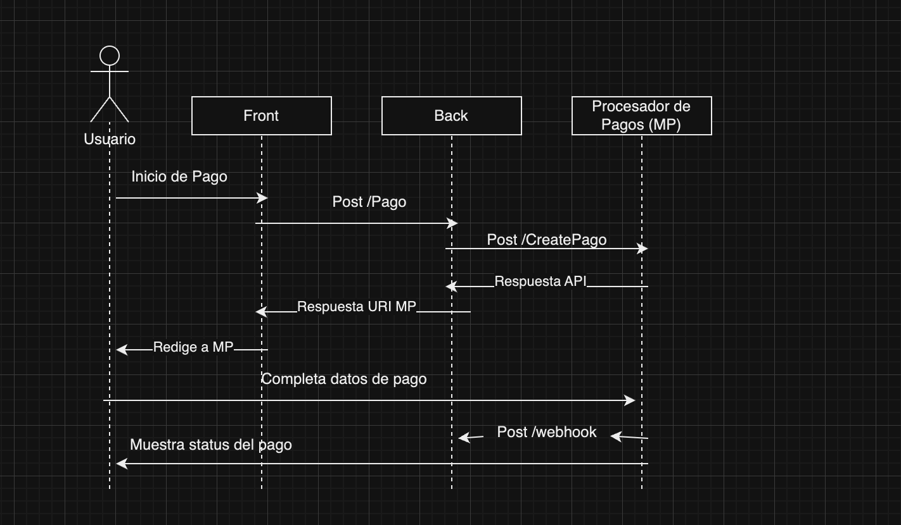

# BAR APP

### Levantar aplicaciones

_Para iniciar las 2 aplicaciones hay que tener instalado docker-compose y ejecutar solamente el siguiente comando_

`docker-compose up -d`

_Este comando se va a encargar de buildear ambas imagenes y ponerlas a correr_

## Backend

### Tests

_Se creo un archivo makefile para simplificar la ejecucion de los test_

_Simplemente hay que entrar a la carpeta backend y ejecutar los siguiente comandos_

`make init`

`make test`

_El init va crear un .venv donde se instalaran los requirements_
_El test va a ejecutar los test_

### Curl de prueba

Caso OK:

```
curl --location 'http://localhost:8080/api/v1/order/1' -> 200 OK
```

Caso NOT OK:

```
curl --location 'http://localhost:8080/api/v1/order/2' -> 404 Not Found
```

## Frontend

### Tests

_Para ejecutar los tests del front hay que entrar a la carpeta frontend y ejecutar los siguiente comandos_

`npm install`

`npm test`

### Caso de Prueba

Caso Ok

```
http://localhost:3000/order/1
```

## Integracion con procesador de pago



_Esta integracion esta pensada para un procesador de pagos que proveea un redirect a su sitio y luego nos pase el status del pago. Como ejemplo voy a usar MercadoPago_

_Nuestro backend tiene que exponer un webhook al cual el procesador de pagos nos va ir informando el cambio de estado de la orden de pago creada_

_Nuestro frontend tiene que exponer al menos 2 urls, una de success y otra de failure para que el procesador de pago haga el redirect despues de efectuarse el pago_

_Cuando el usuario le da al boton pagar de nuestro sitio, por detras le hace un request a nuestra backend que es el que inicia la transaccion en MP dando detalle de la compra y seteando el precio_

_Una vez que tenemos respuesta del procesador nos debemos guardar el id de transaccion asociada a la orden y devolverle al front la ruta a la cual debe redirigirse._

_El front redirige a la app de MP_

_El Usuario se encarga de completar todo el pago y una vez que termino, el procesador de pagos se encargar de notificar al backend el status del pago y redirige al front dependiendo el estado_

_Del lado del webhook lo recomendable seria que no se encarge de procesar la respuesta, ya que no es necesario que sea sincronico el cambio de estado en nuestra base, sino que la envie a una cola, asi se desocupa rapido y no tenemos problemas para seguir recibiendo request del procesador de pago._

_En caso que nuestro endpoint de webhook este caido cuando nos pegan, perderiamos el cambio de estado, por lo tanto lo recomendable es tener un cronjob o algun proceso que busque en la base todos las transacciones que haya pasado X tiempo sin hacer el cambio de estado y haga un request a la api del procesador de pago para ver cual es el status y si hace faltar actualizarlo._
